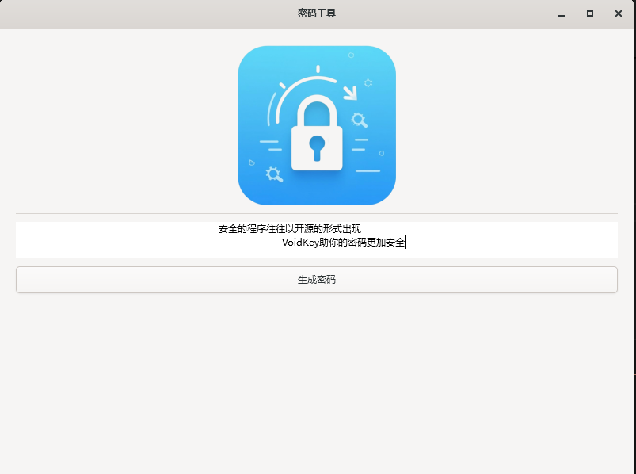

# 🔐 VoidKey 密码工具

✨ **一个现代化的GTK4密码管理工具** ✨

---

## 🚀 功能特性

- 🎨 **现代化GUI界面** - 使用GTK4构建的漂亮界面
- 🔢 **密码生成器** - 支持自定义长度的数字密码
- 🛡️ **安全存储** - 本地加密保存密码

```bash
# 示例密码生成
密码长度: 12
生成结果: 583920184736
```

---

## 📦 安装指南

### 开发环境系统要求
- GTK4 开发环境
- CMake 3.10+
- GCC/Clang 编译器

### 安装步骤
1. 克隆仓库:
```bash
git clone https://github.com/zs-yg/VoidKey.git
cd VoidKey
```

2. 编译安装:
```MSYS2 UCRT64 bash
make
```

---

## 🖥️ 使用说明

### 主界面


1. 点击"生成密码"按钮
2. 设置密码长度
3. 选择密码类型(当前仅支持数字)
4. 点击"生成"获取密码

---


---

## 🤝 贡献指南

欢迎提交PR! 请遵循以下流程:

1. Fork项目
2. 创建特性分支 (`git checkout -b feature/AmazingFeature`)
3. 提交更改 (`git commit -m 'Add some AmazingFeature'`)
4. 推送到分支 (`git push origin feature/AmazingFeature`)
5. 打开Pull Request

---

## 📜 许可证

本项目采用 **MIT许可证** - 详情请见 [LICENSE](LICENSE) 文件。

---

## 📞 联系方式

📧 Email: chr_super@outlook.com  

## 推广
```bash
qq群：1043867176
```

---

<div align="center">
✨ 感谢您对VoidKey的关注 ✨
</div>
